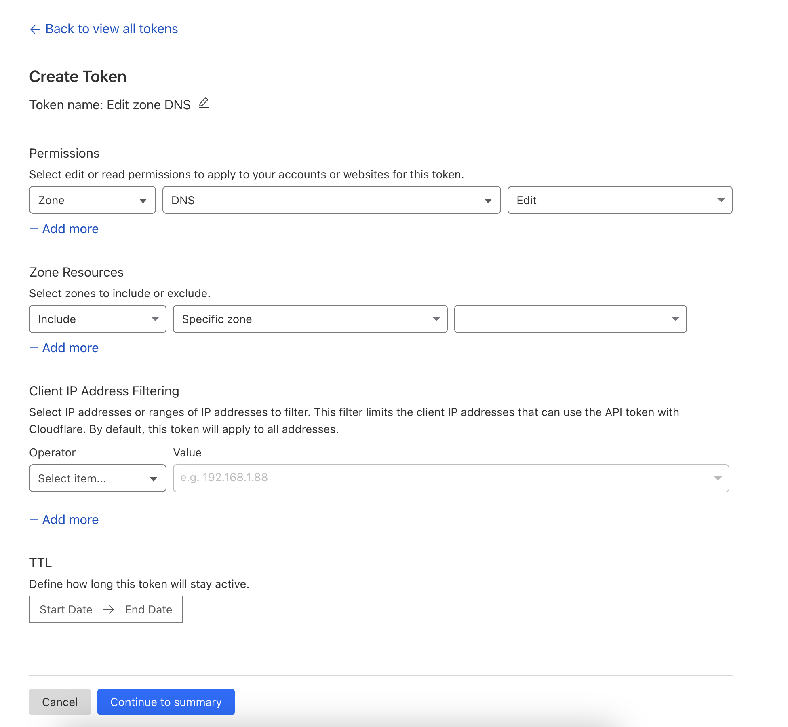

# Guide to Using Auto DNS

## Function Description
- Auto DNS is used to automatically update the DNS of a node after you save it on Cloudflare or on your node.
- If you save a new IP on the node, the new IP will be updated on Cloudflare within a minute, and vice versa, if you update the IP on Cloudflare, Cloudflare will push the new IP back to your node in one minute.

## Preparation

- ZoneID -> Obtain from Cloudflare
- Token -> Obtain from Cloudflare

## Setup Instructions

### Step 1: Obtain ZoneID

- In the first line, you'll find the ZoneID from Cloudflare, which looks like this:

- Copy and paste this into Line 1 of the config.

### Step 2: Obtain Token

- 1: Go to Cloudflare and click on 'Get your API Token'.
- 2: Select 'Create Token' -> choose the 'Edit zone DNS' template.
- 3: Select the DNS according to the domain you are using.

*In the 'Zone Resources' section, choose the last option for your domain, then click 'Continue to Summary'.*

- 4: Once saved, it will display the token. Copy and paste this token into the admin web like the ZoneID, and that's it! 

*Note: When using auto DNS, the Server Address on the node must use Domain*