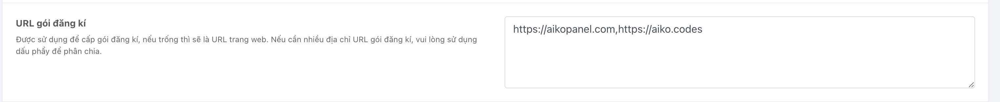
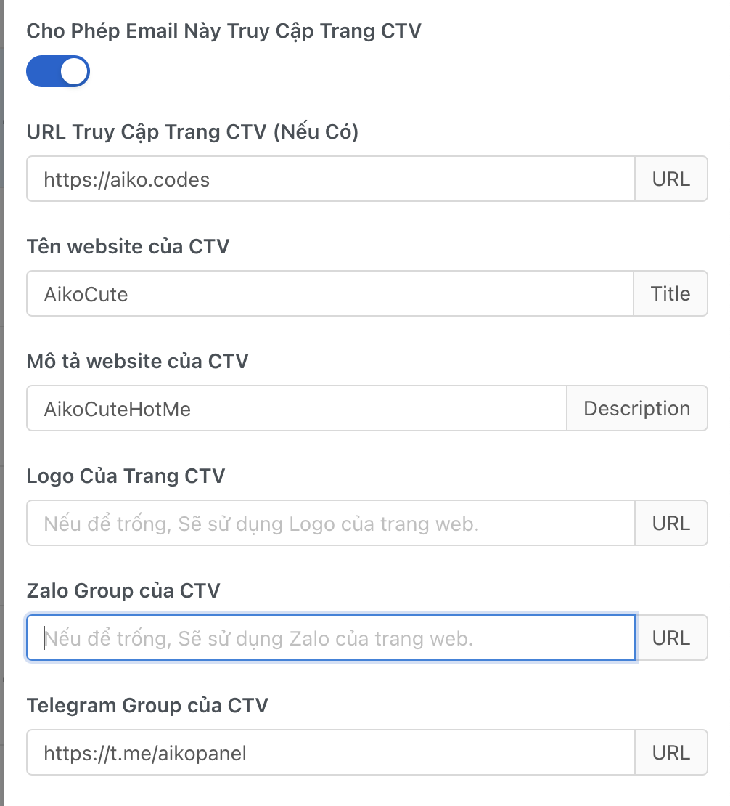

# Creating a Collaborator Website

## Function Description
- The website allows collaborators to sell on their personal domain and offer collaborator packages, which can generate revenue for them (packages must be approved by the admin).

## Preparation
- Own a personal domain.

## Setup Process

### Step 1: Create a domain pointing to the IP of the node




**Note: The domain must point to the node's IP, and each domain should be separated by a comma.**

### Step 2: Create a website on the node
- Add a new site on WebAdmin (aapanel) with the same path as the main domain. Do not create an additional database, and enable SSL + URL rewrite as on the main website.
- For example: If the source directory is AikoPanel, set it up as follows:

 

- Use the collaborator's domain name.


- After creating, go to the nginx.conf file of the main domain and add the following code (on aapanel, it's in the Rewrite Rules section):

```
location /downloads {
}

location / {
    try_files $uri $uri/ /index.php$is_args$query_string;
}

location ~ .*\.(js|css)?$
{
    expires      1h;
    error_log off;
    access_log /dev/null;
}
```

### Step 3: Create a custom package for the collaborator


### Step 4: Create a collaborator account

- Enable the collaborator function and select the collaborator package for them.

- Personalize the collaborator's page if desired.


### Step 5: Set up the collaborator's management path
- In the system settings under the security section, fill in the path of the collaborator's website.


### Step 6: Visit the collaborator's website to check