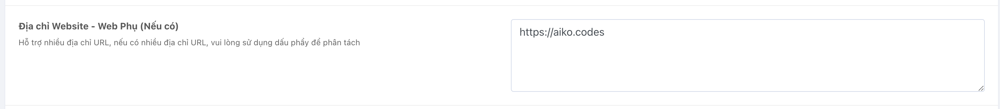
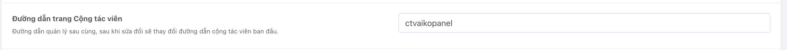

# Creating a Collaborator Website

## Functionality Description
- The website allows collaborators to sell on their personal domain and offer collaborator packages, which can generate revenue for them (these packages must be approved by the admin).

## Preparation
- Own a personal domain.

## Setup Process

### Step 1: Create a domain pointing to the IP of the node




**Note: The domain must point to the IP of the node, and each domain should be separated by a comma.**

### Step 2: Create a website on the node
- Add a new site on WebAdmin (aapanel) with the same path as the main domain's path. Do not create an additional database, and enable SSL + URL rewrite as with the main web.

```
location /downloads {
}

location / {
    try_files $uri $uri/ /index.php$is_args$query_string;
}

location ~ .*\.(js|css)?$
{
    expires      1h;
    error_log off;
    access_log /dev/null;
}
```

### Step 3: After creation, create a specific package for the collaborator


### Step 4: Create a collaborator account


- You need to enable the collaborator function and select a collaborator package for them.

### Step 5: Set up the management path for the collaborator
- After going to system settings under the security section, there will be an option for the collaborator's management path. You need to enter the path of the collaborator's website here.



### Step 6: Once completed, you can visit the collaborator's website to check

Would you like to know more about any specific step or aspect of this process?