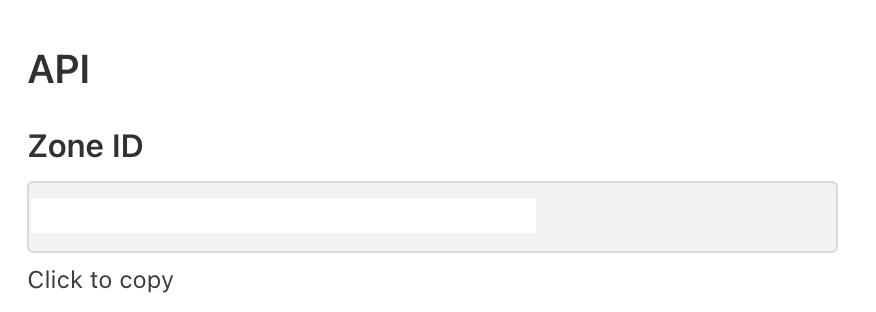

# Hướng dẫn sử dụng Auto DNS

## Mô tả chức năng
- Auto DNS dùng để tự động cập nhật DNS Của node sau khi bạn Save Lưu trữ trên Clouflare hay là Node của bạn 
- Nếu bạn save trên node Ip mới thì Ip mới sẽ được cập nhật vào cloudflare Sau 1 Phút và ngược lại nếu bạn cập nhật ip trên cloudflare thì cloudflare sẽ đẩy IP mới về node của bạn trong 1 phút

## Chuẩn bị

- ZoneID -> Lấy từ Cloudflare
- Token -> Lấy từ cloudflare

## Cách setup

### Step 1 : Lấy ZoneID

- Dòng 1 ZoneID bạn lấy ở Cloudflare nó sẽ dạng như thế này 

- Coppy dán vào Line 1 Của config

### Step 2 : Lấy Token 

- 1: Bạn vào CF bấm vào Get your API Token
- 2: Create Token -> chọn Edit zone DNS template
- 3: Lấy DNS theo miền bạn đang sử dụng

*mục Zone Resources bạn chọn ô cuối là domain của bạn xong bấm Continute to Summary*

- 4: Sua khi lưu nó sẽ hiện ra token và dán token vào admin web như ZoneID là xong nhé