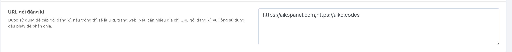
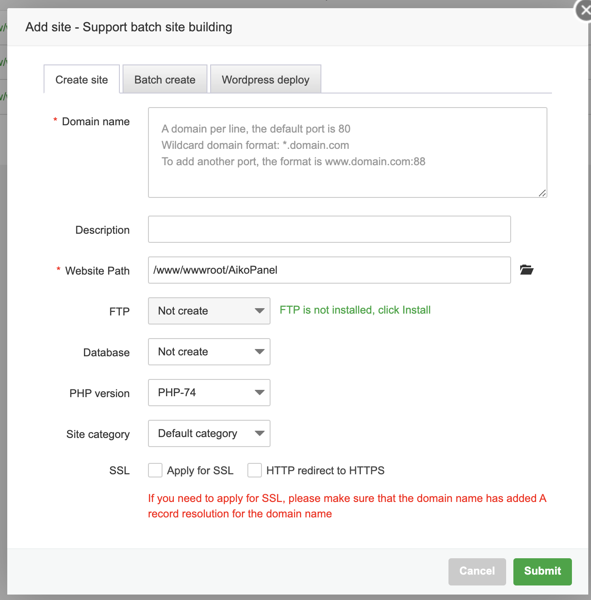
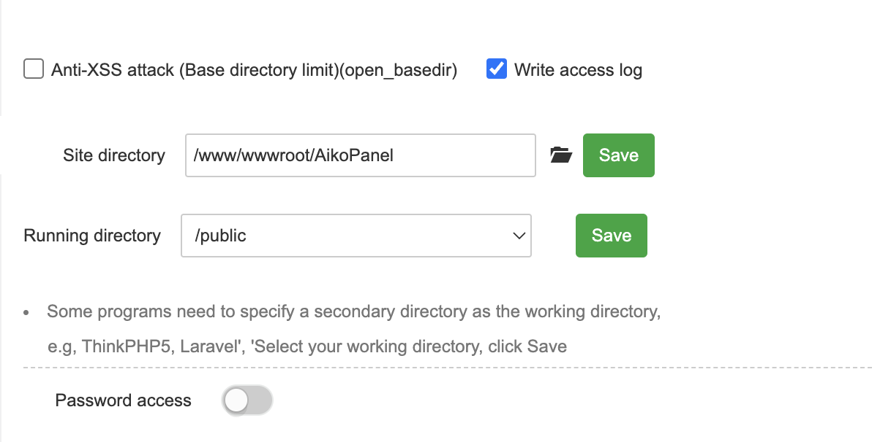
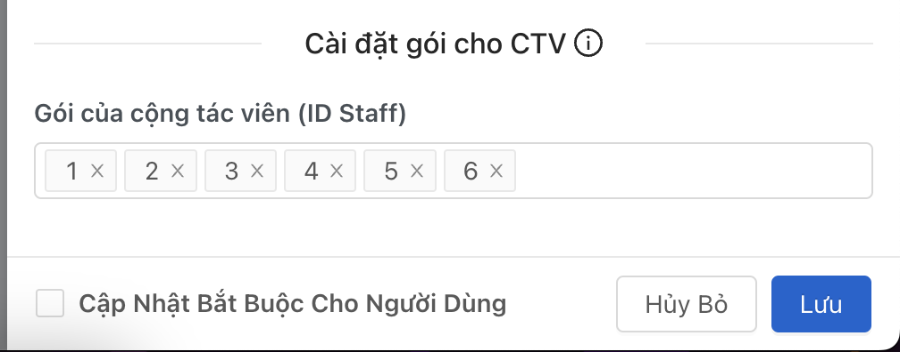
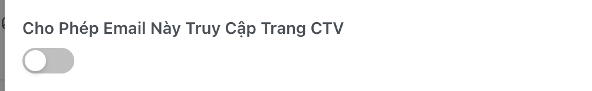
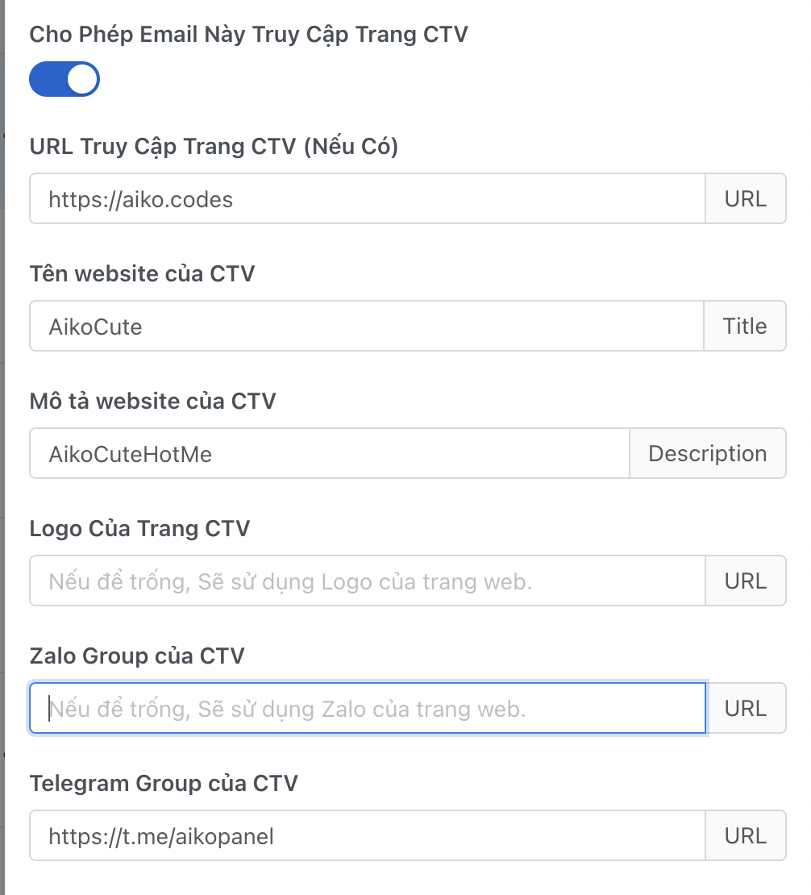
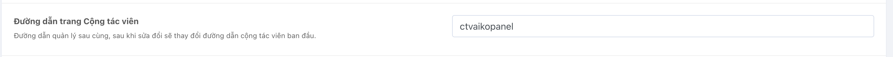

# Tạo trang web cộng tác viên

## Mô tả chức năng
- Trang web có thể giúp công tác viên bán trên domain cá nhân của cộng tác viên và bán gói cộng tác viên có thể tạo ra doanh thu cho cộng tác viên ( Gói cần được duyệt bởi admin )

## Chuẩn bị
- Có 1 domain cá nhân

## Cách setup

### Bước 1: Tạo 1 domain trỏ về IP của node




**Lưu ý: Domain phải được trỏ về IP của node và mỗi domain phân tách nhau bởi dấu ,**

### Bước 2: Tạo 1 trang web trên node
- Add thêm 1 site trên WebAdmin ( aapanel ) với path là chung với path domain chính không tạo thêm database và allow ssl + URL rewrite như web chính
- Ví dụ: Thư mục chứa source là AikoPanel thì đặt như sau :

 

- Với domain name là domain của cộng tác viên



- Sau khi tạo xong bạn cần vào file nginx.conf của domain chính và thêm đoạn code sau vào ( Trên aapanel thì mục Rewrite Rules )

```
set_real_ip_from 103.21.244.0/22;
set_real_ip_from 103.22.200.0/22;
set_real_ip_from 103.31.4.0/22;
set_real_ip_from 104.16.0.0/13;
set_real_ip_from 104.24.0.0/14;
set_real_ip_from 108.162.192.0/18;
set_real_ip_from 131.0.72.0/22;
set_real_ip_from 141.101.64.0/18;
set_real_ip_from 162.158.0.0/15;
set_real_ip_from 172.64.0.0/13;
set_real_ip_from 173.245.48.0/20;
set_real_ip_from 188.114.96.0/20;
set_real_ip_from 190.93.240.0/20;
set_real_ip_from 197.234.240.0/22;
set_real_ip_from 198.41.128.0/17;
set_real_ip_from 2400:cb00::/32;
set_real_ip_from 2606:4700::/32;
set_real_ip_from 2803:f800::/32;
set_real_ip_from 2405:b500::/32;
set_real_ip_from 2405:8100::/32;
set_real_ip_from 2a06:98c0::/29;
set_real_ip_from 2c0f:f248::/32;
real_ip_header CF-Connecting-IP;

location /downloads {
}

location / {
    try_files $uri $uri/ /index.php$is_args$query_string;
}

location ~ .*\.(js|css)?$
{
    expires      1h;
    error_log off;
    access_log /dev/null;
}
```

### Bước 3: Sau khi tạo xong bạn tạo gói riêng cho cộng tác viên



### Bước 4: Tạo 1 tài khoản cộng tác viên


- Bạn cần bật chức năng cộng tác viên lên và chọn gói cộng tác viên cho cộng tác viên đó

- Xong cá nhân hoá trang cộng tác viên nếu muốn



### Bước 5: Cài đặt đường dẫn quản lý của cộng tác viên
- Sau khi vào thiết lập hệ thống mục an toàn sẽ có 1 mục là đường dẫn quản lý của cộng tác viên bạn cần điền đường dẫn của trang web cộng tác viên vào đây




### Bước 6 : Xong bạn có thể vào trang web cộng tác viên để kiểm tra